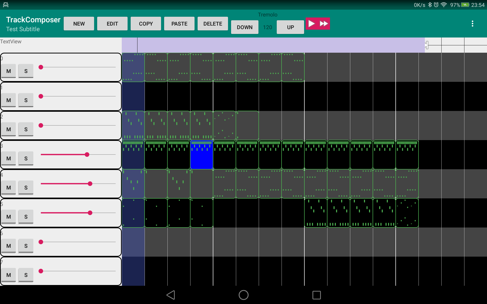

# Track Composer

 Because why use an off the shelf one when you can write your own?
 
 WIP, use at your own discretion.
 
 Tracks
 - Percussion
 - Chords, simplified keyboard where only a chord progression can be used.
 - Notes, for melodies.
 
 Instruments
 - Samples (can load ogg files)
 - Synth (just a sin for now)
  
 
 
